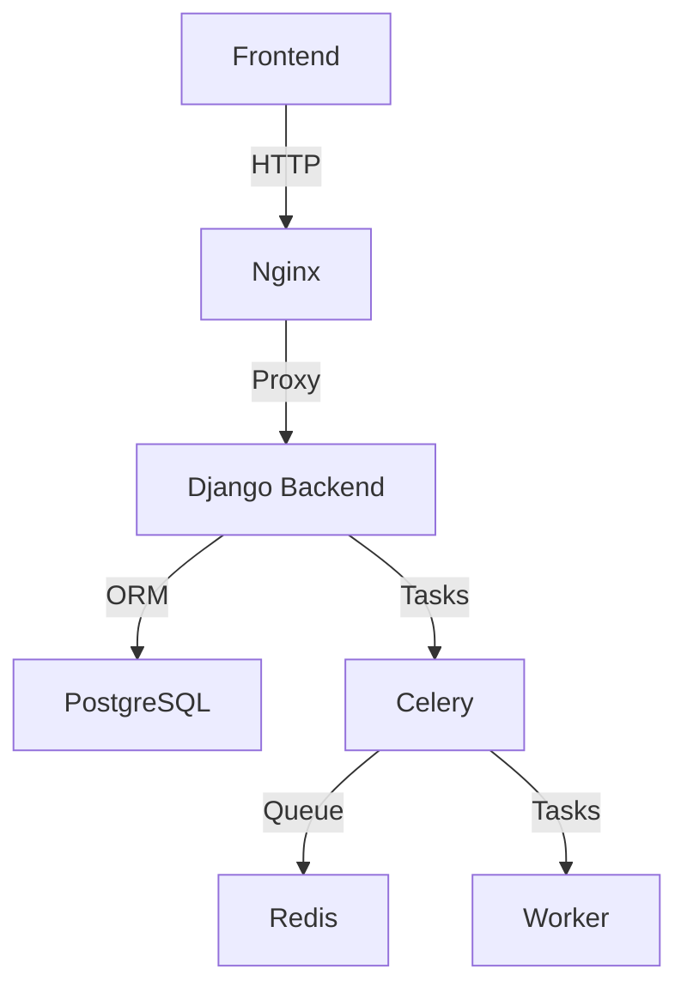

# Vital Bio Backend

A Django-based backend service for managing medical devices, test protocols, and results.

## Architecture



## Components

### Backend Services
- **Django Backend** (`vitalbio-backend`): Main API server
  - RESTful API endpoints
  - Token-based authentication
  - Django ORM for database operations
  - Django REST Framework for API views

- **PostgreSQL** (`vitalbio-db`): Primary database
  - Stores all application data
  - Managed through Django migrations

- **Celery** (`vitalbio-celery`): Task queue
  - Handles asynchronous tasks
  - Background job processing
  - Scheduled tasks

- **Redis** (`vitalbio-redis`): Message broker
  - Queue management for Celery
  - Caching layer

### Frontend Service
- **React Frontend** (`vitalbio-frontend`): User interface
  - Material-UI components
  - Token-based authentication
  - Data tables for CRUD operations

## API Endpoints

### Authentication
- `POST /api/token/`: Get authentication token
  ```json
  {
    "username": "string",
    "password": "string"
  }
  ```

### Devices
- `GET /api/devices/devicelist/`: List all devices
- `POST /api/devices/devicelist/`: Create new device
- `GET /api/devices/devicelist/{id}/`: Get device details
- `PUT /api/devices/devicelist/{id}/`: Update device
- `DELETE /api/devices/devicelist/{id}/`: Delete device

### Test Protocols
- `GET /api/devices/protocols/`: List all protocols
- `POST /api/devices/protocols/`: Create new protocol
- `GET /api/devices/protocols/{id}/`: Get protocol details
- `PUT /api/devices/protocols/{id}/`: Update protocol
- `DELETE /api/devices/protocols/{id}/`: Delete protocol

### Test Results
- `GET /api/devices/results/`: List all results
- `POST /api/devices/results/`: Create new result
- `GET /api/devices/results/{id}/`: Get result details
- `PUT /api/devices/results/{id}/`: Update result
- `DELETE /api/devices/results/{id}/`: Delete result

### Users
- `GET /api/users/users/`: List all users
- `POST /api/users/users/`: Create new user
- `GET /api/users/users/{id}/`: Get user details
- `PUT /api/users/users/{id}/`: Update user
- `DELETE /api/users/users/{id}/`: Delete user

## Development

### Prerequisites
- Docker
- Docker Compose

### Running the Application
```bash
# Build and start all services
docker-compose up --build

# Run in detached mode
docker-compose up -d

# Stop all services
docker-compose down
```

### Environment Variables
- `DEBUG`: Enable debug mode (default: 0)
- `SECRET_KEY`: Django secret key
- `ALLOWED_HOSTS`: Comma-separated list of allowed hosts
- `DATABASE_URL`: PostgreSQL connection URL
- `REDIS_URL`: Redis connection URL

## Database Schema

### Device
- `name`: Device name
- `device_type`: Type of device
- `model_number`: Model number
- `manufacturer`: Manufacturer name
- `assigned_to`: Foreign key to User

### TestProtocol
- `name`: Protocol name
- `version`: Protocol version
- `status`: Protocol status
- `created_by`: Foreign key to User

### TestResult
- `device`: Foreign key to Device
- `protocol`: Foreign key to TestProtocol
- `status`: Test status
- `performed_by`: Foreign key to User
- `start_time`: Test start time
- `end_time`: Test end time

### User
- `username`: Username
- `email`: Email address
- `is_staff`: Staff status
- `is_active`: Active status