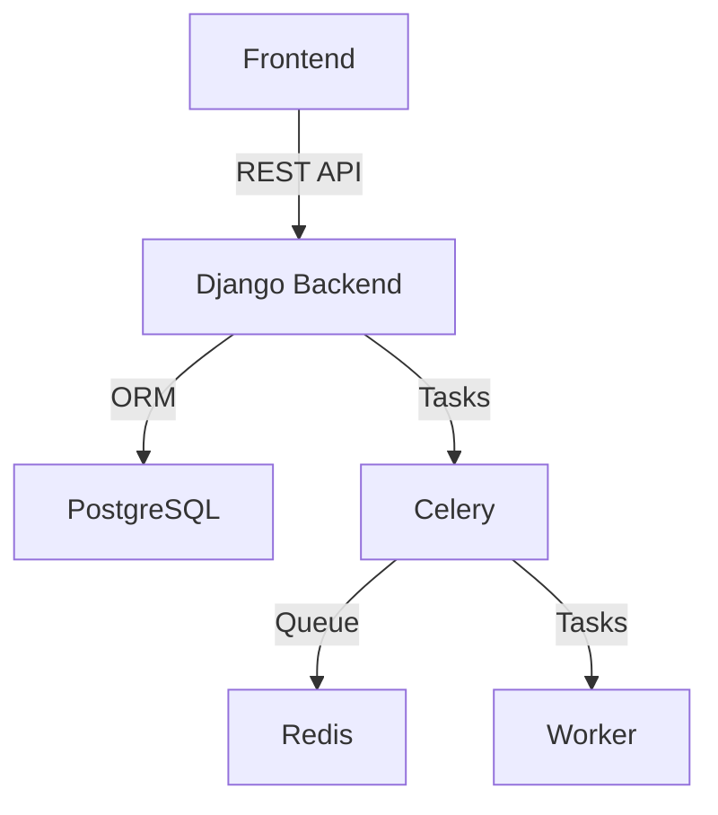
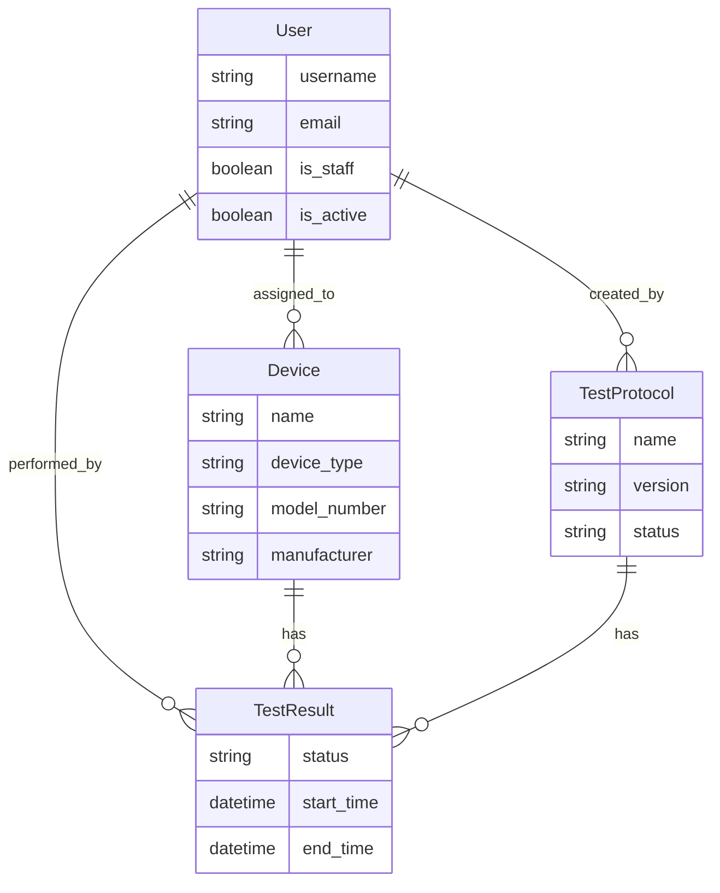
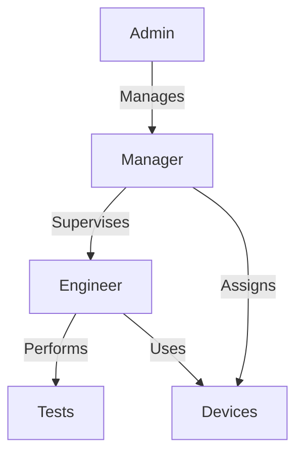

# Vital Bio Device Test Dashboard 

A Django-based backend service for managing medical devices, test protocols, and test results. The frontend is built with React, and Celery is integrated for handling background tasks like sending emails upon specific actions. The application is containerized using Docker, with Docker Compose for service orchestration.

## Architecture



## Database Schema



## User Hierarchy



### Installation

1. **Prerequisites**
   - Docker and Docker Compose installed
   - Git (for cloning the repository)
   - Ports 3000, 8000, 5432 available

2. **Quick Start**
   ```bash
   # Clone the repository
   git clone  https://github.com/nhuzaa/django-celery-starter 

   # Copy .env
   cp .env.example .env

   # Start all services
   docker compose up --build

   # Run migration and seed data 
   docker compose exec backend ./init_db.sh

   ```

3. **Initial Setup**
   - Database migrations run automatically
   - Superuser is created with credentials:
     ```
     Username: admin
     Password: admin123
     ```
   - Sample data is seeded into the database
   - All services are configured and connected

4. **Accessing the Application**
   - Backend admin: http://localhost:8000/admin
   - Frontend: http://localhost:3000
   - Swagger UI: http://localhost:8000/swagger/
   - Database: localhost:5432
   - Redis: localhost:6379
   - Celery : when TestResult is crated 'devices/signals.py' is triggerd which queues the celery task to send out email

### API Documentation

1. **Interactive Documentation**
   - Swagger UI: http://localhost:8000/swagger/
     - Interactive API testing interface
     - Request/response examples
     - Authentication support
     - Schema validation

2. **Postman Collection**
   - Location: `/docs/postman/`
   - Import both collection and environment files
   - Pre-configured requests for all endpoints
   - Environment variables for easy switching

3. **Authentication**
   ```bash
   # Get token
   curl -X POST http://localhost:8000/api/token/ \
     -H "Content-Type: application/json" \
     -d '{"username": "admin", "password": "admin123"}'
   ```

4. **API Structure**
   - Base URL: http://localhost:8000/api/
   - Token-based authentication
   - JSON request/response format
   - Standard HTTP methods (GET, POST, PUT, DELETE)

## Run Tests

 After running the coontainers
```
docker compose exec backend python manage.py test devices.tests.test_views 
```

## Components

### Backend Services
- **Django Backend** (`vitalbio-backend`): Main API server
  - RESTful API endpoints
  - Token-based authentication
  - Django ORM for database operations
  - Django REST Framework for API views

- **PostgreSQL** (`vitalbio-db`): Primary database
  - Stores all application data
  - Managed through Django migrations

- **Celery** (`vitalbio-celery`): Task queue
  - Handles asynchronous tasks
  - Background job processing
  - Scheduled tasks

- **Redis** (`vitalbio-redis`): Message broker
  - Queue management for Celery
  - Caching layer

### Frontend Service
- **React Frontend** (`vitalbio-frontend`): User interface
  - Material-UI components
  - Token-based authentication
  - Data tables for CRUD operations

## API Endpoints

### Authentication
- `POST /api/token/`: Get authentication token
  ```json
  {
    "username": "string",
    "password": "string"
  }
  ```

### Devices
- `GET /api/devices/devicelist/`: List all devices
- `POST /api/devices/devicelist/`: Create new device
- `GET /api/devices/devicelist/{id}/`: Get device details
- `PUT /api/devices/devicelist/{id}/`: Update device
- `DELETE /api/devices/devicelist/{id}/`: Delete device

### Test Protocols
- `GET /api/devices/protocols/`: List all protocols
- `POST /api/devices/protocols/`: Create new protocol
- `GET /api/devices/protocols/{id}/`: Get protocol details
- `PUT /api/devices/protocols/{id}/`: Update protocol
- `DELETE /api/devices/protocols/{id}/`: Delete protocol

### Test Results
- `GET /api/devices/results/`: List all results
- `POST /api/devices/results/`: Create new result
- `GET /api/devices/results/{id}/`: Get result details
- `PUT /api/devices/results/{id}/`: Update result
- `DELETE /api/devices/results/{id}/`: Delete result

### Users
- `GET /api/users/users/`: List all users
- `POST /api/users/users/`: Create new user
- `GET /api/users/users/{id}/`: Get user details
- `PUT /api/users/users/{id}/`: Update user
- `DELETE /api/users/users/{id}/`: Delete user

## Development

### Prerequisites
- Docker
- Docker Compose

### Running the Application
```bash
# Build and start all services
docker-compose up --build

# Run in detached mode
docker-compose up -d

# Stop all services
docker-compose down
```

### Environment Variables
- `DEBUG`: Enable debug mode (default: 0)
- `SECRET_KEY`: Django secret key
- `ALLOWED_HOSTS`: Comma-separated list of allowed hosts
- `DATABASE_URL`: PostgreSQL connection URL
- `REDIS_URL`: Redis connection URL

## Database Schema

### Device
- `name`: Device name
- `device_type`: Type of device
- `model_number`: Model number
- `manufacturer`: Manufacturer name
- `assigned_to`: Foreign key to User

### TestProtocol
- `name`: Protocol name
- `version`: Protocol version
- `status`: Protocol status
- `created_by`: Foreign key to User

### TestResult
- `device`: Foreign key to Device
- `protocol`: Foreign key to TestProtocol
- `status`: Test status
- `performed_by`: Foreign key to User
- `start_time`: Test start time
- `end_time`: Test end time

### User
- `username`: Username
- `email`: Email address
- `is_staff`: Staff status
- `is_active`: Active status

## Screenshots

Below are some example screenshots from the application to help you visualize the UI and features.

---


*This screenshot shows the main device list table in the frontend, where users can view all registered medical devices and their details.*

---


*This screenshot displays the details of a selected device, including its type, model number, and assigned engineer.*

---


*This screenshot shows the list of test protocols available in the system, including their status and associated devices.*

---


*This screenshot displays the test results table, where users can review the outcome of various device tests.*

---


*This screenshot shows the user management interface, where admins can view and manage user accounts and roles.*

---


*This screenshot provides an overview dashboard, summarizing key metrics and recent activity in the system.*

---

## Video Demo

For a detailed walkthrough of the application features and functionality, check out our video demo:

[](https://www.youtube.com/watch?v=ypQsgKvplTk)

*Click the thumbnail above to watch the full demo video.*

---

## Project Structure

```
vital-bio/
├── backend/
│   ├── config/                 # Django project settings
│   │   ├── settings.py        # Main settings file
│   │   ├── urls.py           # Main URL configuration
│   │   └── wsgi.py           # WSGI configuration
│   │
│   ├── devices/              # Devices app
│   │   ├── migrations/       # Database migrations
│   │   ├── tests/           # Test files
│   │   ├── models.py        # Device, Protocol, and Result models
│   │   ├── serializers.py   # API serializers
│   │   ├── views.py         # API views and viewsets
│   │   └── urls.py          # App URL configuration
│   │
│   ├── users/               # Users app
│   │   ├── migrations/      # Database migrations
│   │   ├── models.py        # Custom user model
│   │   ├── permissions.py   # Custom permissions
│   │   ├── serializers.py   # User serializers
│   │   ├── views.py         # User views
│   │   └── urls.py          # App URL configuration
│   │
│   ├── manage.py            # Django management script
│   └── requirements.txt     # Python dependencies
│
├── frontend/
│   ├── public/             # Static files
│   ├── src/
│   │   ├── components/     # React components
│   │   ├── services/       # API services
│   │   ├── types/         # TypeScript types
│   │   ├── App.tsx        # Main App component
│   │   └── index.tsx      # Entry point
│   ├── package.json        # Node.js dependencies
│   └── tsconfig.json       # TypeScript configuration
│
├── docs/                   # Documentation
│   ├── Screenshots/       # Application screenshots
│   └── postman/          # Postman collection
│
├── .env.example           # Example environment variables
├── docker-compose.yml     # Docker services configuration
├── Dockerfile            # Backend Docker configuration
└── README.md             # Project documentation
```

### Key Directories Explained

#### Backend
- **config/**: Contains Django project settings, URL routing, and WSGI configuration
- **devices/**: Main app for device management, test protocols, and results
- **users/**: Handles user authentication, roles, and permissions

#### Frontend
- **src/components/**: Reusable React components
- **src/services/**: API integration and data fetching
- **src/types/**: TypeScript type definitions

#### Documentation
- **docs/Screenshots/**: UI screenshots and examples
- **docs/postman/**: API testing collections

#### Configuration Files
- **docker-compose.yml**: Defines and orchestrates all services
- **.env.example**: Template for environment variables
- **requirements.txt**: Python package dependencies