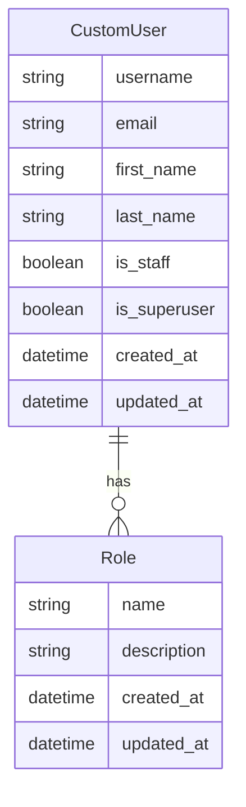
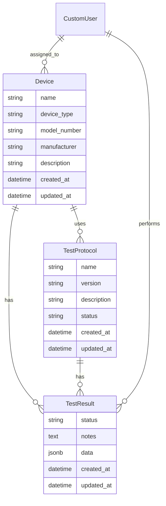
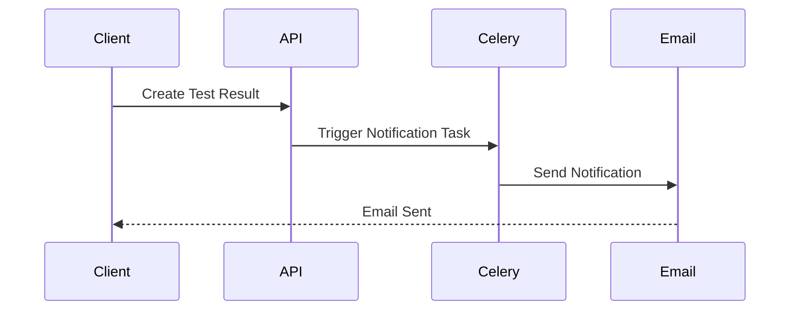

# VitalBio Medical Device Management System

A Django-based system for managing medical devices, test protocols, and test results with role-based access control.

## Features

- Role-based access control (Manager and Engineer roles)
- Device management and assignment
- Test protocol creation and management
- Test result tracking and notifications
- RESTful API with Swagger documentation
- Asynchronous task processing with Celery
- Email notifications for test results

## Installation

### Prerequisites

- Docker and Docker Compose
- Python 3.12+
- PostgreSQL

### Setup

1. Clone the repository:
```bash
git clone <repository-url>
cd vital-bio
```

2. Create a `.env` file in the root directory:
```bash
cp .env.example .env
```

3. Update the `.env` file with your configuration:
```env
DEBUG=True
SECRET_KEY=your-secret-key
DATABASE_URL=postgres://postgres:postgres@db:5432/vitalbio
EMAIL_HOST=smtp.gmail.com
EMAIL_PORT=587
EMAIL_HOST_USER=your-email@gmail.com
EMAIL_HOST_PASSWORD=your-app-password
EMAIL_USE_TLS=True
```

4. Build and start the containers:
```bash
docker-compose build
docker-compose up
```

5. Initialize the database:
```bash
docker-compose exec web python manage.py migrate
docker-compose exec web python manage.py seed
```

## Database Schema

### Users and Roles



### Devices and Tests



## Celery Setup

The system uses Celery for asynchronous task processing, primarily for sending email notifications when test results are created.

### Task Flow



### Configuration

Celery is configured in `config/celery.py` with the following settings:
- Broker: Redis
- Backend: Redis
- Task Queues: Default and Email
- Task Routes: Email tasks routed to email queue

### Tasks

1. `send_test_result_notification`: Sends email notifications when a test result is created
   - Triggered by post_save signal
   - Sends to admin users
   - Includes test result details

## API Documentation

The API is documented using Swagger/OpenAPI. Access the documentation at:
```
http://localhost:8000/api/docs/
```

### Authentication

The API uses Token Authentication. To authenticate:
1. Get a token: `POST /api/token/`
2. Use the token in headers: `Authorization: Token <your-token>`

### Endpoints

- Users:
  - `GET /api/users/`: List users
  - `POST /api/users/`: Create user
  - `GET /api/users/{id}/`: Get user details

- Devices:
  - `GET /api/devices/`: List devices
  - `POST /api/devices/`: Create device
  - `GET /api/devices/{id}/`: Get device details
  - `POST /api/devices/{id}/assign/`: Assign device to engineer

- Test Protocols:
  - `GET /api/protocols/`: List protocols
  - `POST /api/protocols/`: Create protocol
  - `GET /api/protocols/{id}/`: Get protocol details

- Test Results:
  - `GET /api/results/`: List results
  - `POST /api/results/`: Create result
  - `GET /api/results/{id}/`: Get result details

## Role-Based Access Control

### Manager Role
- Can view all devices
- Can create and manage test protocols
- Can assign devices to engineers
- Can view all test results

### Engineer Role
- Can only view assigned devices
- Can create test results for assigned devices
- Can view test results for assigned devices

## Development

### Running Tests
```bash
docker-compose exec web python manage.py test
```

### Code Style
The project uses:
- Black for code formatting
- Flake8 for linting
- isort for import sorting

Run code quality checks:
```bash
docker-compose exec web black .
docker-compose exec web flake8
docker-compose exec web isort .
```

## Deployment

For production deployment:
1. Set `DEBUG=False` in `.env`
2. Configure proper email settings
3. Set up SSL/TLS
4. Configure proper database backups
5. Set up monitoring and logging

## License

This project is licensed under the MIT License - see the LICENSE file for details.